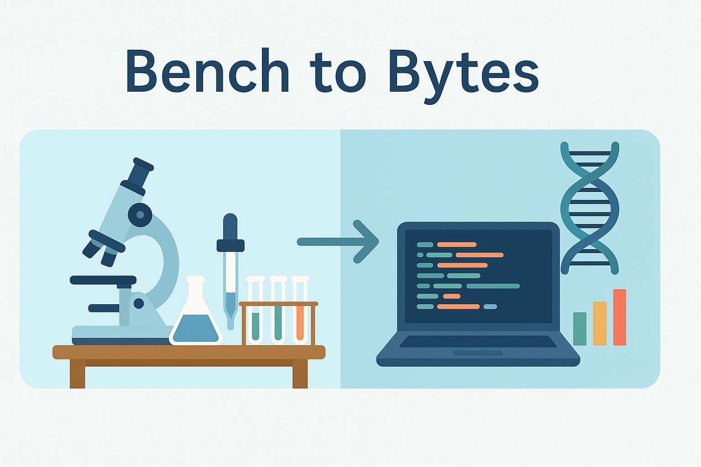
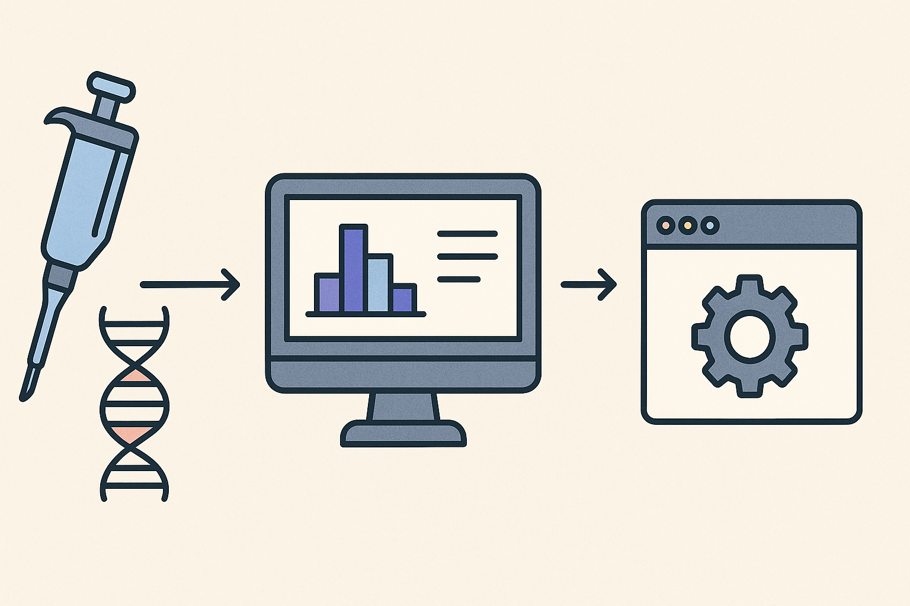

Hi, I’m Kristen Coutinho — a PhD student exploring gene regulation using both **wet lab experiments** and **computational biology**.

Bench2Bytes is where I will be sharing ideas, experiences, and lessons learned while working with:
- RNA-seq, ATAC-seq, and single-cell datasets  
- Tools like DESeq2, edgeR, Seurat, and Scanpy  
- Workflow design, quality control, and efficiency tips  

Each post reflects real decisions I made during research — how I think through a tool, what I watch for, and the tradeoffs that matter when working with complex data. 

Whether you're just starting out or refining your own approach to bioinformatics, I hope you’ll find something useful here.

> From bench to bytes — one thoughtful analysis at a time.



<h2>Latest Post</h2>

<h3><a href="{{ latest_post.url | relative_url }}">{{ latest_post.title }}</a></h3>

<em>{{ latest_post.date | date: "%B %d, %Y" }}</em>

{{ latest_post.excerpt }}

<a href="{{ latest_post.url | relative_url }}">Read more</a>

